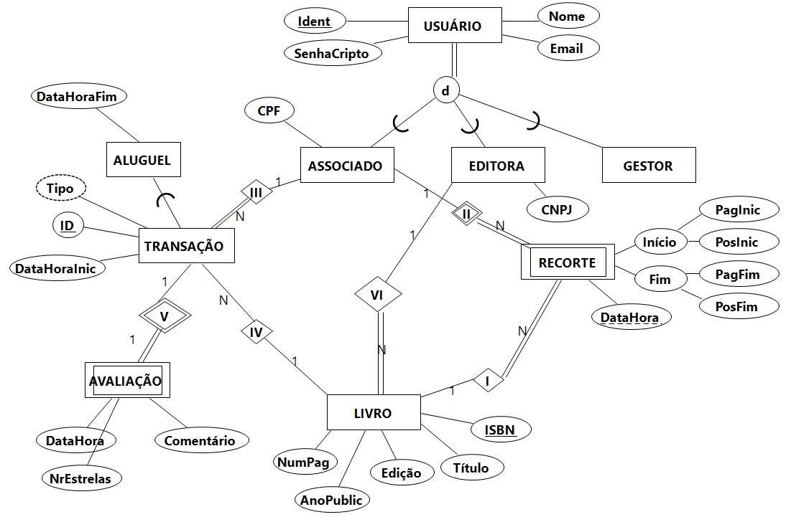

## [Tópico T04b] - Requisitos de Dados - `BD Livraria Virtual`
###### *by Prof. Plinio Sa Leitao-Junior (INF/UFG)*

### Livro Digital _vs._ Serviço _vs._ Software _vs._ Banco de Dados

:sparkles: **LIVRO DIGITAL** 
`Livro digital` (livro eletrônico, _e-book_) é qualquer conteúdo de informação, semelhante a um livro, existindo ou não sua versão em papel, cujo conteúdo é codificado em formato digital, que pode ser lido em equipamentos eletrônicos.

:sparkles: **SERVIÇO** 
`Livraria Virtual` é um serviço prestado àqueles que desejam ter a facilidade e a praticidade no manuseio e na leitura de livros digitais. Basicamente, o usuário pode alugar ou comprar (o mesmo que alugar por tempo indeterminado) livros digitais, para lê-los usando um _e-reader_(\*). 
(\*) _e-reader é um dispositivo eletrônico móvel projetado para ler e-books e periódicos digitais_.

:sparkles: **SOFTWARE** 
Para viabilizar o serviço **Livraria Virtual**, vários _softwares_ serão necessários, tais como: software para _e-reader_, software para manutenção (aquisição, descarte, etc.) do acervo digital, software para a gestão financeira do serviço, dentre outros.

:sparkles: **BANCO DE DADOS** 
O fornecimento do serviço requer um banco de dados, capaz de viabilizar as funcionalidades dos diversos _softwares_ utilizados.

### Perfis de Usuário

:star2: `Associado` 
O usuário que primariamente utiliza o serviço é chamado de ASSOCIADO (pessoa física), aquele interessado na leitura de livros digitais. Basicamente, representa a pessoa que se associa ao serviço, mediante um valor monetário pago mensalmente, onde tal concede o direito de uso do serviço.

:star2: `Editora` 
O usuário que fornece os livros digitais é chamado EDITORA, visando a incorporá-los ao acervo de livros do serviço.

:star2: `Gestor` 
O usuário responsável pela gestão administrativa e financeira do serviço é denominado GESTOR.

### Demandas Informacionais

:star2: `Associado` 
Quantos são os recortes do livro X ? 
Quais os meus recortes no livro X ? 
Quais os títulos mais adquiridos [no período X] ? 
Quais os títulos mais alugados no [período X] ? 
Quais os títulos abandonados no [período X] ? 
Quais os títulos mais desejados no [período X] ? 
Quais os títulos com melhores avaliações no [período X] ? 

:star2: `Editora` 

:star2: `Gestor` 
Quais as sessões de uso em cada software no [período X] ? 

#### Conceitos
Livro digital 
Equipamentos eletrônicos 
Livraria virtual 
Alugar ou comprar 
e-reader, software manutenção, software gestão 
associado, editora, gestor 
associado aluga e compra livro digital 
livro e recorte de livro 
período X 
títulos mais adquiridos no período X 
títulos mais alugados no período X 
- SELECT L.ISBN , L.Titulo, COUNT(*) As QtdeAluguel 
FROM TRANSACAO AS T JOIN LIVRO A L 
            ON T.ISBN = L.ISBN 
WHERE Tipo = "A"  (Same as DataHoraFim IS NOT NULL) 
AND      DataHoraInic BETWEEN :Data1 AND :Data2 
GROUP BY L.ISBN , L.Titulo 
ORDER BY QtdeAluguel DESC

títulos abandonados no período X 
títulos mais desejados no período X 
títulos com melhores avaliações no período X 

### DER Livraria Virtual

Arquivo EERCASE [Aqui](https://github.com/plinioleitao/bd-2024-1-bcc/blob/main/media/bd-2024-1-der-livraria-virtual.eer)

|Esquema Lógico|
|-|
|USUARIO (Ident, TipoUsuario, Nome, Email, SenhaCripto) USUARIO (Ident) IS PRIMARY KEY|
|ASSOCIADO (Ident, Nome, Email, SenhaCripto, CPF) ASSOCIADO (Ident) IS PRIMARY KEY ASSOCIADO (Ident) REFERENCES USUARIO (Ident)|
|LIVRO (ISBN, Titulo, Edicao, NumPag, AnoPublic) LIVRO (ISBN) IS PRIMARY KEY|
|TRANSACAO (Ident, ISBN, DataHoraInic, DataHoraFim) TRANSACAO (Ident) IS PRIMARY KEY TRANSACAO (ISBN) REFERENCES LIVRO (ISBN)|
|EDITORA (Ident, Nome, Email, SenhaCripto, CNPJ) EDITORA (Ident) IS PRIMARY KEY EDITORA (Ident) REFERENCES USUARIO (Ident)|
|RECORTE  (IdentAssociado, DataHora, PagInic, PosInic, PagFim, PosFim, ISBN) RECORTE  (IdentAssociado, DataHora) IS PRIMARY KEY RECORTE  (IdentAssociado) REFERENCES ASSOCIADO (Ident) RECORTE (ISBN) REFERENCES LIVRO (ISBN)|
|AVALIACAO (IdentTransacao, DataHora, Comentario, NumEstrelas) AVALIACAO (IdentTransacao) IS PRIMARY KEY AVALIACAO (IdentTransacao) REFERENCES Transacao (ident)|
